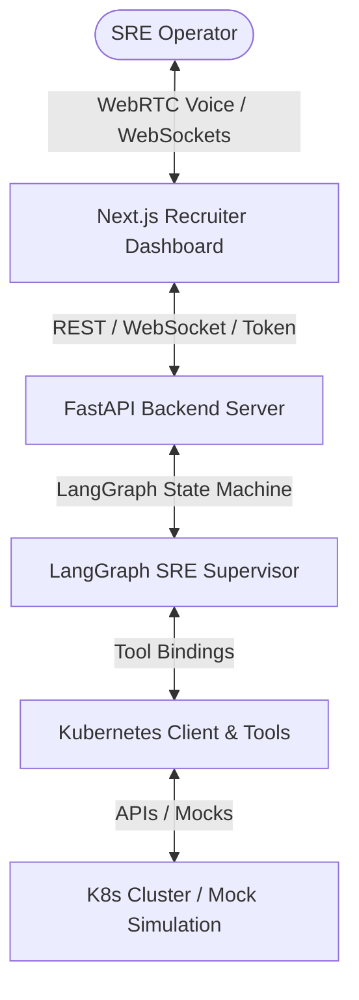

# Voice-Activated SRE (Agentic Infrastructure Supervisor)

A real-time, voice-driven Agentic Co-pilot designed for Kubernetes cluster telemetry, diagnostics, and remediation. This project transforms traditional cluster management and MLOps supervision into an interactive, voice-driven experience using **FastAPI**, **LangGraph**, **LiveKit WebRTC**, and **Next.js**.

---

## 🌟 Key Features

*   **🎙️ Real-Time Voice Transport**: Powered by LiveKit WebRTC, incorporating Silero Voice Activity Detection (VAD), Whisper Speech-to-Text (STT), and OpenAI Text-to-Speech (TTS) for low-latency voice streaming.
*   **🧠 LangGraph Orchestration**: Orchestrated as a state machine (`LISTEN` → `REASON` → `TOOL_USE` → `SYNTHESIZE`) that manages conversational context, routes requests, and performs deterministic checks.
*   **💾 Conversational Memory**: Integrated checkpointer memory (`MemorySaver`) that persists context across speech turns (e.g. asking *"Restart it"* targeting the previously diagnosed pod).
*   **⚙️ Deterministic Kubernetes Tools**: Official Python Kubernetes Client integration for querying cluster telemetry (`get_pod_status`, `get_node_metrics`) and executing remediation actions (`restart_pod`, `scale_deployment`).
*   **🧪 Resilient Mock Simulation Mode**: Automatic environment detection. If a live Kubernetes cluster context (Minikube/Kind) is missing, the backend defaults to high-fidelity, in-memory state mutations (e.g. scaling pods in mock mode updates the in-memory state dynamically).
*   **📺 War Room Dashboard (Next.js + WebSockets)**: A recruiter-facing web interface featuring a glowing audio visualizer, live telemetry feeds, manual override actions, and a real-time terminal logging the agent's internal reasoning loop via WebSockets.

---

## 🏗️ Project Architecture



---

## 📁 Directory Structure

```
voice_sre/
├── requirements.txt       # Python backend dependencies
├── cli.py                 # Interactive Text-based Agent CLI (Phase 2 Demo)
├── livekit_agent.py       # LiveKit voice transport worker script (Phase 3 Voice Agent)
├── Dockerfile             # FastAPI backend container definition
├── docker-compose.yml     # Multi-container orchestrator (FastAPI + Next.js)
├── app/                   # FastAPI backend application package
│   ├── __init__.py
│   ├── main.py            # API routes, WS agent streamer & LiveKit token generator
│   ├── config.py          # Configuration manager using Pydantic Settings
│   ├── agents/
│   │   ├── __init__.py
│   │   └── supervisor.py  # LangGraph Agent Supervisor definition & nodes
│   └── tools/
│       ├── __init__.py
│       └── kubernetes.py  # Read/Write Kubernetes tools (Mock + Live)
├── frontend/              # Next.js frontend application package
│   ├── Dockerfile         # Next.js web application container definition
│   ├── package.json       # Node package manager configurations
│   ├── src/app/
│   │   ├── page.tsx       # Live War Room Dashboard client page
│   │   └── globals.css    # Tailwind CSS styling imports
└── tests/                 # Automation testing packages
    ├── __init__.py
    ├── test_k8s_tools.py  # Telemetry tool unit tests
    └── test_agent.py      # LangGraph state machine, WebSockets & API integration tests
```

---

## 🚀 Getting Started

### Option A: Run via Docker Compose (Recommended)
You can start both the FastAPI backend and Next.js frontend services with a single command:
```bash
docker-compose up --build
```
- Open the dashboard at [http://localhost:3000](http://localhost:3000)
- The backend API runs on [http://localhost:8000](http://localhost:8000)

### Option B: Local Setup (Manual)

#### 1. Setup Backend
1. Create virtual environment and install packages:
   ```bash
   python -m venv .venv
   .venv\Scripts\activate  # Windows
   pip install -r requirements.txt
   ```
2. Start the FastAPI server:
   ```bash
   python -m app.main
   ```
   *Note: Interactive documentation is available at [http://localhost:8000/docs](http://localhost:8000/docs).*

#### 2. Run Text CLI Demo
Test the LangGraph state loops and memory checkpointer in your terminal:
```bash
python cli.py
```
*Try typing: `"check pods in production"`, `"scale payment-gateway to 5"`, `"are they running now?"`.*

#### 3. Setup Frontend
1. Install node modules:
   ```bash
   cd frontend
   npm install
   ```
2. Run the Next.js dev server:
   ```bash
   npm run dev
   ```
   *Open [http://localhost:3000](http://localhost:3000) to access the Dashboard.*

---

## 🧪 Testing
Run the complete unit and integration test suite (covering Kubernetes tools, FastAPI routers, websocket streaming, and multi-turn agent memory):
```bash
.venv\Scripts\activate
pytest
```
*All 13 integration tests are automated and execute in < 4 seconds.*
